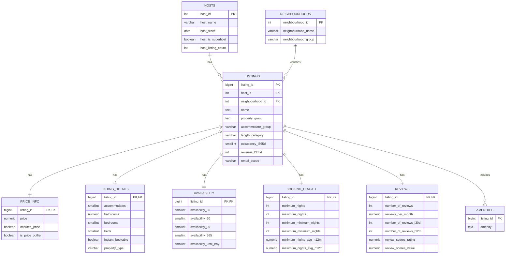

```mermaid
erDiagram

    HOSTS ||--o{ LISTINGS : "has"

    NEIGHBOURHOODS ||--o{ LISTINGS : "contains"

    LISTINGS ||--|| PRICE_INFO : "has"
    LISTINGS ||--|| LISTING_DETAILS : "has"
    LISTINGS ||--|| AVAILABILITY : "has"
    LISTINGS ||--|| BOOKING_LENGTH : "has"
    LISTINGS ||--|| REVIEWS : "has"

    LISTINGS ||--o{ AMENITIES : "includes"

    HOSTS {
        int host_id PK
        varchar host_name
        date host_since
        boolean host_is_superhost
        int host_listing_count
    }

    LISTINGS {
        bigint listing_id PK
        int host_id FK
        int neighbourhood_id FK
        text name
        text property_group
        varchar accommodate_group
        varchar length_category
        smallint occupancy_l365d
        int revenue_l365d
        varchar rental_scope
    }

    NEIGHBOURHOODS {
        int neighbourhood_id PK
        varchar neighbourhood_name
        varchar neighbourhood_group
    }

    PRICE_INFO {
        bigint listing_id PK, FK
        numeric price
        boolean imputed_price
        boolean is_price_outlier
    }

    LISTING_DETAILS {
        bigint listing_id PK, FK
        smallint accommodates
        numeric bathrooms
        smallint bedrooms
        smallint beds
        boolean instant_bookable
        varchar property_type
    }

    AVAILABILITY {
        bigint listing_id PK, FK
        smallint availability_30
        smallint availability_60
        smallint availability_90
        smallint availability_365
        smallint availability_until_eoy
    }

    BOOKING_LENGTH {
        bigint listing_id PK, FK
        int minimum_nights
        int maximum_nights
        int minimum_minimum_nights
        int maximum_minimum_nights
        numeric minimum_nights_avg_n12m
        numeric maximum_nights_avg_n12m
    }

    REVIEWS {
        bigint listing_id PK, FK
        int number_of_reviews
        numeric reviews_per_month
        int number_of_reviews_l30d
        int number_of_reviews_l12m
        numeric review_scores_rating
        numeric review_scores_value
    }

    AMENITIES {
        bigint listing_id FK
        text amenity
    }
```
