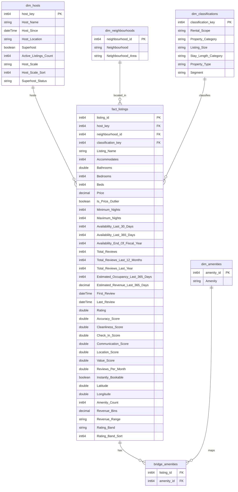

# Schema ERD — Toronto Airbnb Market Analysis

This diagram shows the **Power BI semantic model** (star schema) as it currently exists in the report, including calculated columns.

**Reading the diagram**

* Column names match the Power BI model. Mermaid does not allow spaces or special characters in attribute names, so spaces are replaced with underscores and parentheses are dropped (e.g. `Estimated Revenue (Last 365 Days)` appears as `Estimated\_Revenue\_Last\_365\_Days`). Exact Power BI names, and the matching PostgreSQL source columns, are listed in the [Data Dictionary](./Data_Dictionary.md).
* Data types are Power BI types (`int64`, `decimal`, `double`, `string`, `boolean`, `dateTime`). PostgreSQL types are listed in the Data Dictionary.
* `"hidden"` = hidden from Report view. `"calculated"` = DAX calculated column (not present in the PostgreSQL source).
* Key columns (`\*\_key`, `\*\_id`) keep their snake\_case source names because they are hidden technical fields.

## Relationships

All relationships are one-to-many, with the filter flowing from the "one" side to the "many" side unless noted.

|From (many side)|To (one side)|Filter direction|Notes|
|-|-|-|-|
|`fact\_listings\[host\_key]`|`dim\_hosts\[host\_key]`|Single||
|`fact\_listings\[neighbourhood\_id]`|`dim\_neighbourhoods\[neighbourhood\_id]`|Single||
|`fact\_listings\[classification\_key]`|`dim\_classifications\[classification\_key]`|Single||
|`bridge\_amenities\[listing\_id]`|`fact\_listings\[listing\_id]`|**Both**|Bi-directional so that an amenity selection filters `fact\_listings`, which is what every `Amenity, …` measure relies on.|
|`bridge\_amenities\[amenity\_id]`|`dim\_amenities\[amenity\_id]`|Single||

## Hierarchies

|Table|Hierarchy|Levels|
|-|-|-|
|`dim\_neighbourhoods`|Neighbourhood Area Hierarchy|Neighbourhood Area → Neighbourhood|
|`dim\_classifications`|Property Category Hierarchy|Property Category → Property Type|

## Other Model Objects

* **`bridge\_amenities`** is a hidden table; users interact with amenities only through `dim\_amenities`.
* **`Measures List`** is a disconnected, empty calculated table used only as a home for DAX measures (35 measures organized into the display folders *Revenue*, *Occupancy*, *Listings*, *Amenities*, and *Price Metrics*). It has no relationships, so it is not shown in the diagram. See the Data Dictionary for the full measure list.
* **`room\_type`** exists in the PostgreSQL `reporting.fact\_listings` table but is removed in Power Query and is **not loaded** into the Power BI model.

## Reporting Layer Design

The reporting model was transformed from a highly normalized source structure into a dimensional model optimized for analytics and Power BI reporting.

### Fact Table

* `fact\_listings`

  * One row per Airbnb listing.
  * Stores occupancy, revenue, pricing, review, and availability metrics.

### Dimensions

* `dim\_hosts`
* `dim\_neighbourhoods`
* `dim\_classifications`
* `dim\_amenities`

### Bridge Table

* `bridge\_amenities`

  * Resolves the many-to-many relationship between listings and amenities.

### Benefits

* Simplified DAX calculations
* Improved query performance
* Reduced model complexity
* Consistent business classifications

