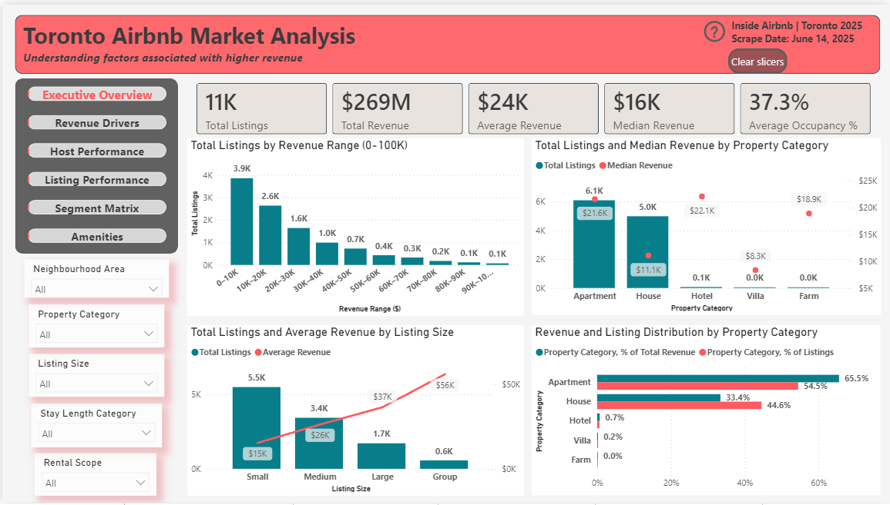
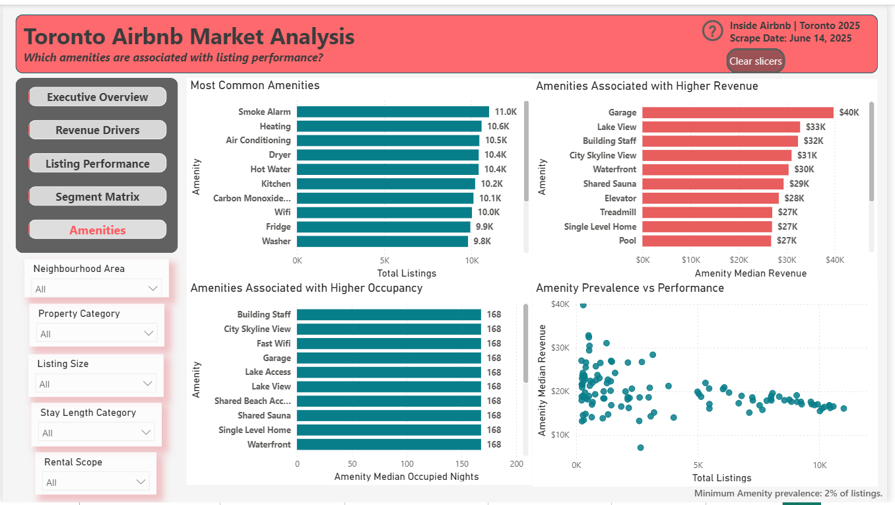
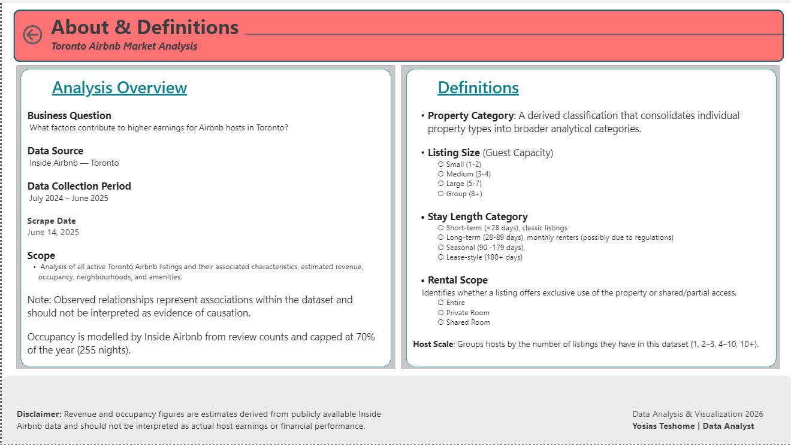

# 🏙️ Toronto Airbnb Market Analysis

**An end-to-end BI project identifying which listing characteristics are associated with higher Airbnb revenue in Toronto — from raw source data to an interactive Power BI reporting model.**


---

## 📌 Project Overview

This project analyzes ~11,000 active Toronto Airbnb listings (Inside Airbnb, July 2024 – June 2025) to identify which property characteristics — location, size, category, stay length, and amenities — are associated with stronger revenue and occupancy performance. It was built in two phases: an initial 2025 SQL/Excel analysis, later revisited and expanded in 2026 into a full Power BI reporting solution after completing the Microsoft Power BI Data Analyst (PL-300) certification.

The result is a complete BI pipeline: a cleaned, normalized PostgreSQL database → a dimensional reporting model → an interactive, six-page Power BI report.

## ❓ Business Questions

- Which **property categories** (Apartment, House, Hotel, Villa, Farm) show the strongest revenue and occupancy?
- How does **listing size** (guest capacity) relate to performance?
- How does **stay length** relate to performance — and does it reflect Toronto's short-term rental regulations?
- Which **neighbourhoods** command a revenue premium?
- Which **amenities** are associated with stronger performance, once small-sample noise is controlled for?
- Which **combinations of characteristics** — and which individual listings — outperform the market?

## 🖼️ Dashboard Preview

| Executive Overview | Revenue Drivers |
|---|---|
|  |  |

| Listing Performance | Segment Matrix |
|---|---|
|  |  |

| Amenities | About & Definitions |
|---|---|
|  |  |

*Full-resolution screenshots available in [`Dashboard/Current/Screenshots/`](Dashboard/Current/Screenshots/).*

## ✨ Key Features

- **📊 Executive KPI Monitoring** — total listings, total/average/median revenue, and average occupancy surfaced at a glance, with full cross-report filtering by neighbourhood, category, size, stay length, and rental scope.
- **💰 Revenue Analysis** — median and average revenue broken out by property category, listing size, stay length, and neighbourhood, with a revenue-distribution view across the full market.
- **🛌 Occupancy Analysis** — occupancy paired against revenue across every major segment, exposing revenue/occupancy trade-offs (e.g. larger, longer-stay listings vs. higher-occupancy short-term listings).
- **📍 Geographic Analysis** — neighbourhood-level revenue ranking across Toronto's 140+ neighbourhoods, grouped into broader analytical areas.
- **⭐ Review Analysis** — listing-level ratings and review counts surfaced alongside top revenue performers, adding a quality dimension to raw performance ranking.
- **🚩 Exception Reporting** — inactive listings, imputed prices, price outliers, and duplicate records are flagged (not silently dropped) throughout the pipeline, keeping the analysis transparent and auditable. See [`Documentation/SQL Code.md`](Documentation/SQL%20Code.md).

## 🔄 Data Pipeline

```
Source Data (Inside Airbnb)
        │
        ▼
  SQL Database (PostgreSQL)
   cleaning · feature engineering · normalization
        │
        ▼
   Data Modeling
   star schema · fact/dimension/bridge tables
        │
        ▼
     Power BI
   Power Query · DAX · report design
        │
        ▼
     Insights
  revenue drivers · segments · exceptions
```

## 🛠️ Technology Stack

| Category | Tools |
|---|---|
| **Database** | PostgreSQL |
| **Query Language** | SQL |
| **BI Platform** | Power BI |
| **Data Transformation** | Power Query |
| **Analytical Layer** | DAX |
| **Version Control** | GitHub |

## 🧱 Data Model

The reporting layer is a **star schema** built specifically for Power BI performance and usability:

- **`fact_listings`** — one row per listing (the model's grain)
- **`dim_hosts`**, **`dim_neighbourhoods`**, **`dim_classifications`** — dimension tables for host, location, and property-classification attributes, with `dim_classifications` consolidating property category, listing size, stay length, and rental scope into a single low-cardinality dimension
- **`dim_amenities`** + **`bridge_amenities`** — a bridge table resolving the many-to-many relationship between listings and amenities

Full schema detail: [`Documentation/Reporting Schema.md`](Documentation/Reporting%20Schema.md) · [`Documentation/Data Dictionary.md`](Documentation/Data%20Dictionary.md)

## 📁 Repository Structure

```
├── README.md
├── Data/
│   ├── Airbnb_toronto_cleaned.csv        # cleaned, analysis-ready dataset
│   └── Data_source.md                    # source, scope, and collection details
├── Dashboard/
│   ├── Current/
│   │   ├── Airbnb_Analytics.pbix         # final Power BI report
│   │   └── Screenshots/                  # dashboard page previews
│   └── Previous Excel dashboard/
│       ├── Airbnb Toronto Dashboard.xlsx     # original 2025 Excel deliverable
│       └── Airbnb Toronto Presentation.pptx  # presentation summary
└── Documentation/
    ├── Project Writeup.md                # full case study
    ├── Data Dictionary.md                # field-level definitions
    ├── Reporting Schema.md               # star schema design (Phase 2)
    ├── SQL Code.md                       # full SQL, organized by workflow stage
    ├── DAX Measures.md                   # DAX measures & calculated columns
    └── Project Roadmap.md                # project history and development steps
```

## 🧠 Skills Demonstrated

- **ETL** — sourcing, cleaning, and transforming raw Airbnb data into an analysis-ready dataset
- **SQL Development** — schema design, constraints, window/aggregate functions, array handling, view-based reporting
- **Data Modeling** — normalized relational design for the source database
- **Dimensional Modeling** — star schema with fact, dimension, and bridge tables for Power BI
- **DAX** — a consistent, extensible measure library with context manipulation and data-quality-aware (threshold-gated) calculations
- **Dashboard Design** — a six-page, purpose-built Power BI report with consistent cross-filtering and a deliberate visual system
- **Documentation** — reviewer-ready technical documentation across the full project lifecycle

## 📚 Documentation

| Document | Description |
|---|---|
| [Data Dictionary](Documentation/Data%20Dictionary.md) | Field-level definitions across the dataset |
| [SQL Documentation](Documentation/SQL%20Code.md) | Full SQL, organized by workflow stage |
| [Measures Documentation](Documentation/DAX%20Measures.md) | DAX measures and calculated columns by category |
| [Reporting Schema](Documentation/Reporting%20Schema.md) | Star schema powering the Power BI model (Phase 2) |
| [Project Write-Up](Documentation/Project%20Writeup.md) | Full case study, written for hiring managers and technical reviewers |
| [Project Roadmap](Documentation/Project%20Roadmap.md) | Project history and development steps across both phases |

## 📊 Results

- **Apartments dominate revenue share** — 54% of listings but 66% of total estimated revenue.
- **Size is associated with revenue** — all five top-performing segments consist of Large or Group listings (5+ guests), though larger/longer-stay listings trend toward lower occupancy than smaller, short-term ones.
- **Location carries a real premium** — the top 10 neighbourhoods by median revenue range from roughly $20K to $36K, independent of property type.
- **Common amenities ≠ high-performing amenities** — baseline amenities (Wi-Fi, heating, A/C) are near-universal, while amenities associated with higher revenue (garage, lake view, building staff, waterfront) signal larger or higher-end properties.
- **Data quality was handled transparently** — inactive listings, imputed prices, price outliers, and duplicate records were flagged, not silently removed, keeping the analysis auditable end to end.

Full findings: [`Documentation/Project Writeup.md`](Documentation/Project%20Writeup.md)

## 👤 Author

**Yosias Teshome**
*Data Analyst*

This project reflects an iterative, self-directed approach to analytics: starting from an exploratory SQL/Excel analysis, then rebuilding and expanding it into a governed, dimensional Power BI solution after formal Power BI certification (PL-300). Feedback and connections welcome.

📧 [Email] · 💼 [LinkedIn] · 🌐 [Portfolio]
